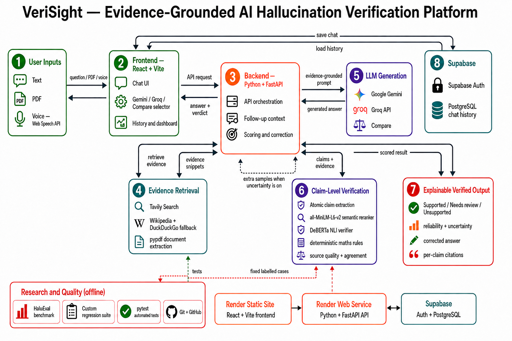

# VeriSight : Evidence-Grounded AI Hallucination Detection System

> A reliability layer for LLM-generated answers. VeriSight retrieves evidence, verifies factual claims, and presents citations with clear, explainable verdicts.

## Overview

Large language models can give polished answers that contain unsupported, incomplete, or incorrect facts. VeriSight helps users inspect an answer before trusting it. It separates answer generation from factual verification, so every factual claim can be checked against relevant web or document evidence.

## How it works

```text
User question, voice input, document, or image
                    |
                    v
          Candidate answer from an LLM
                    |
                    v
       Atomic factual claim extraction
                    |
                    v
 Evidence retrieval, filtering, and semantic ranking
                    |
                    v
      NLI-based claim-to-evidence verification
                    |
                    v
 Verdicts, evidence excerpts, citations, correction,
       reliability signal, and optional uncertainty
```



## Core capabilities

### Claim-level verification

VeriSight breaks an answer into smaller factual statements instead of judging the full paragraph at once. Each claim receives one of these transparent verdicts:

| Verdict | Meaning |
|---|---|
| **Supported** | The selected evidence establishes the claim. |
| **Needs review** | The evidence is incomplete, indirect, or conflicting. |
| **Unsupported** | The evidence contradicts the claim or no usable evidence was found. |

The interface links each verdict to the evidence excerpt used for that decision, helping users see *why* a claim received its label.

### Independent verification layer

An LLM provider produces the candidate answer. VeriSight then independently retrieves evidence and evaluates each factual claim using Natural Language Inference (NLI). This means an answer is not accepted merely because it sounds fluent or confident.

### Flexible evidence modes

- **Web evidence**: retrieves and ranks relevant online sources.
- **Document evidence**: verifies against uploaded PDF text.
- **Image evidence**: extracts readable text from supported images using OCR.
- **Hybrid evidence**: combines uploaded material with web research when both are useful.

### Evidence-grounded correction

When an answer contains unsupported claims and sufficient supporting evidence is available, VeriSight can produce a correction grounded in that evidence. The correction is shown with its citations rather than replacing the original answer silently.

### User-focused experience

- Continuous chat with follow-up awareness
- Optional comparison of available LLM providers
- Voice input through browser speech recognition
- PDF and image upload
- Authentication and saved conversations through Supabase
- Per-claim evidence highlighting and verification feedback
- Deterministic handling for supported mathematical questions

## Verification pipeline

| Stage | Purpose |
|---|---|
| Answer generation | Produces a candidate response to the user’s request. |
| Claim extraction | Identifies the factual statements that need checking. |
| Retrieval | Finds web and/or uploaded-document evidence relevant to the question. |
| Ranking | Uses semantic similarity and source checks to select the most relevant evidence. |
| NLI verification | Tests whether the selected evidence entails, contradicts, or does not establish each claim. |
| Result presentation | Shows claim verdicts, focused evidence excerpts, citations, reliability, and optional uncertainty. |

## Why VeriSight is more than an LLM interface

| Answer generation | VeriSight verification |
|---|---|
| Creates a helpful natural-language response. | Checks factual statements independently against evidence. |
| May be fluent even when a fact is wrong. | Can flag the unsupported statement and show the evidence behind the verdict. |
| Focuses on answering the user. | Focuses on traceability, contradiction detection, and evidence-backed feedback. |

## Technology stack

| Area | Technologies used |
|---|---|
| Frontend | React, Vite, custom CSS, Web Speech API, Supabase JavaScript client |
| Backend | Python, FastAPI, Pydantic, HTTPX, Uvicorn |
| Answer providers | Google Gemini API and Groq API |
| Claim verification | DeBERTa NLI cross-encoder and Sentence Transformers / MiniLM semantic reranking |
| Evidence handling | Web retrieval, source-quality filtering, PDF text extraction, PyMuPDF, Tesseract OCR |
| Special-case checks | Deterministic arithmetic, calculus, factorial, and determinant rules |
| Data and authentication | Supabase Authentication, PostgreSQL, and Row-Level Security |
| Evaluation | HaluEval-based experiments and a custom regression suite |

## Evaluation approach

The `evaluation/` module evaluates the verification layer on labelled claim-and-evidence examples. It is separate from normal user chats and does not rely on an LLM provider or web-search quota during evaluation.

The evaluation workflow uses:

- Held-out HaluEval data to measure verification behavior on unseen examples.
- A custom regression suite for project-specific cases such as retrieval ambiguity, citations, documents, mathematics, and follow-up context.
- Standard classification measures and verification latency to track changes over time.

See [evaluation/README.md](evaluation/README.md) for the methodology, commands, and limitations.

## Repository structure

```text
backend/       FastAPI API, generation, retrieval, verification, and tests
frontend/      React interface, authentication, chat history, and evidence UI
evaluation/    dataset utilities, metrics, and regression cases
docs/          workflow diagrams, database schema, and literature survey
```

## Run locally

1. Copy the example environment files in `backend/` and `frontend/`.
2. Add provider credentials only to the backend environment file. Keep secrets out of version control.
3. Follow the setup and run instructions in the component documentation:
   - [Backend setup](backend/README.md)
   - [Frontend setup](frontend/README.md)
4. Install Tesseract OCR if you want text extraction from images or scanned PDFs. Configure its executable path through the backend environment file when it is not available on your system path.

## Testing

Run the backend test suite from the project root after configuring the environment. Use the evaluation module separately when you want to reproduce verification experiments or check regression cases.

## Security, privacy, and scope

- Environment files, provider keys, virtual environments, dependencies, build output, and generated reports are excluded through `.gitignore`.
- Provider secrets stay on the backend. The frontend uses only the Supabase publishable configuration required for authentication.
- Reliability is an evidence-based estimate, not a guarantee of universal truth. Missing, weak, outdated, or conflicting evidence should be reviewed carefully.
- Image support currently extracts readable text through OCR. It does not yet verify visual details in photographs, charts, or diagrams that contain no readable text.

## Documentation

- [Backend API documentation](backend/README.md)
- [Frontend documentation](frontend/README.md)
- [Evaluation methodology](evaluation/README.md)
- [Supabase schema](docs/supabase-schema.sql)
- [Core literature survey](docs/verisight_core_literature_survey_18_papers.docx)

## Group Project

This project was developed as a group project by the following team members:

- Soham Jathar
- Prathamesh Kolhe
- Bhavika Kadam
- Onkar Deshmukh
